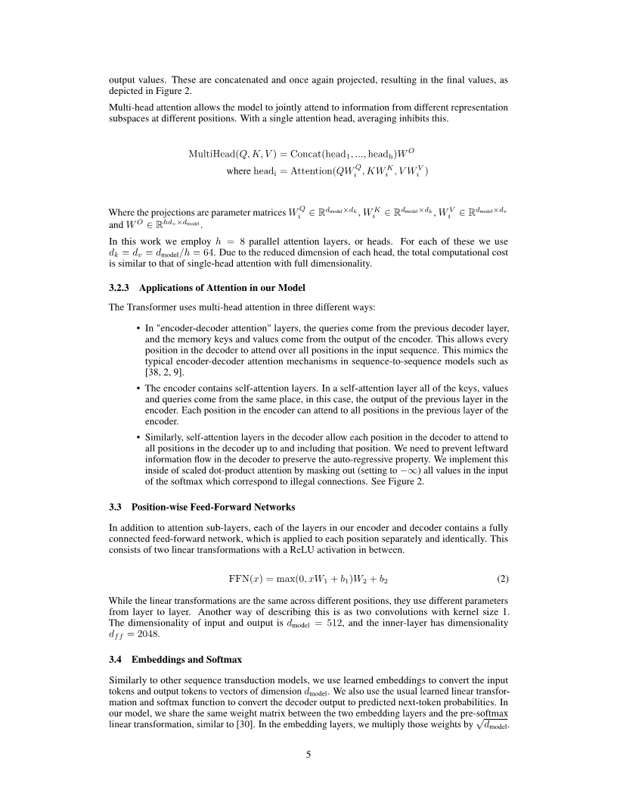

# MathReader: Text-to-Speech for Mathematical Documents

## Abstract
TTS (Text-to-Speech) document reader from Microsoft, Adobe, Apple, and OpenAI have been serviced worldwide. They provide relatively good TTS results for general plain text, but sometimes skip contents or provide unsatisfactory results for mathematical expressions. This is because most modern academic papers are written in LaTeX, and when LaTeX formulas are compiled, they are rendered as distinctive text forms within the document. However, traditional TTS document readers output only the text as it is recognized, without considering the mathematical meaning of the formulas. To address this issue, we propose MathReader, which effectively integrates OCR, a fine-tuned T5 model, and TTS. MathReader demonstrated a lower Word Error Rate (WER) than existing TTS document readers, such as Microsoft Edge and Adobe Acrobat, when processing documents containing mathematical formulas. MathReader reduced the WER from 0.510 to 0.281 compared to Microsoft Edge, and from 0.617 to 0.281 compared to Adobe Acrobat. This will significantly contribute to alleviating the inconvenience faced by users who want to listen to documents, especially those who are visually impaired.

### This page is for anonymous submission for ICASSP 2025.

Here, you can find the experimental code, example wav files, and the test dataset developed for our research.

## Example results from MathReader

### Example 1

### Example 1

<table border="1">
  <colgroup>
    <col style="width:auto;">
    <col style="width:400px;">
    <col style="width:400px;">
  </colgroup>
  <tr>
    <td></td>
    <td align="center"><b>Lecture Audio</b></td>
    <td align="center"><b>ASR result</b></td>
  </tr>
  <tr>
    <td rowspan="4"></td>
    <td>
      <audio controls>
        <source src="audios/example1.wav" type="audio/mpeg">
        Your browser does not support the audio element.
      </audio>
    </td>
    <td>x plus 5y plus 10z equals zero. </td>
  </tr>
  <tr>
    <td align="center"><b>Ours</b></td>
    <td align="center"><b>GPT3.5</b></td>
  </tr>
  <tr>
    <td>$x+5y+10z=0$</td>
    <td>$ x + 5y + 10z = 0 $</td>
  </tr>
  <tr>
    <td style="border-bottom: 2px solid black;"></td>
    <td style="border-bottom: 2px solid black;"></td>
  </tr>
</table>

## Experiment Results

The experimental results of this study can be found at the following link. The link contains four folders, each containing the results of converting the test dataset documents into wav files.
https://drive.google.com/drive/folders/1Fb8QAFFWLukU6kDunjzg5iyKDnDCXH2I?usp=sharing

## How to use MathReader

1. Install Nougat and NVIDIA NeMo and transformers library in your development environment.
   - Nougat github : https://github.com/facebookresearch/nougat
   - NVIDIA NeMo : https://docs.nvidia.com/nemo-framework/user-guide/latest/nemotoolkit/tts/models.html#vits

2. Create a folder named 'test_audio' in the same location as MathReader.py.

3. Modify line 102 in MathReader.py (Write the path of the PDF file you want to perform OCR on.).

4. Run `python MathReader.py` in the terminal.
