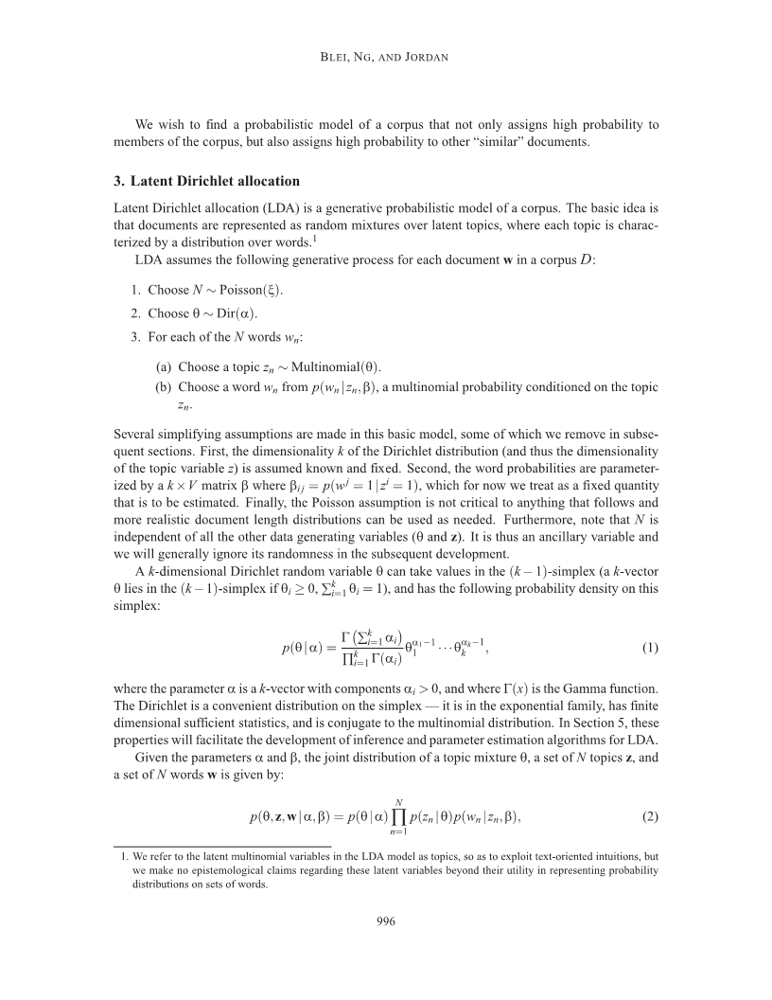

# MathReader: Text-to-Speech for Mathematical Documents

## Abstract
TTS (Text-to-Speech) document reader from Microsoft, Adobe, Apple, and OpenAI have been serviced worldwide. They provide relatively good TTS results for general plain text, but sometimes skip contents or provide unsatisfactory results for mathematical expressions. This is because most modern academic papers are written in LaTeX, and when LaTeX formulas are compiled, they are rendered as distinctive text forms within the document. However, traditional TTS document readers output only the text as it is recognized, without considering the mathematical meaning of the formulas. To address this issue, we propose MathReader, which effectively integrates OCR, a fine-tuned T5 model, and TTS. MathReader demonstrated a lower Word Error Rate (WER) than existing TTS document readers, such as Microsoft Edge and Adobe Acrobat, when processing documents containing mathematical formulas. MathReader reduced the WER from 0.510 to 0.281 compared to Microsoft Edge, and from 0.617 to 0.281 compared to Adobe Acrobat. This will significantly contribute to alleviating the inconvenience faced by users who want to listen to documents, especially those who are visually impaired.

### This page is for submission to ICASSP 2025.

Here, you can listen to an example voice from each TTS document reader.

---

## Example results from MathReader

<table border="1">
  <colgroup>
    <col style="width:800px;">
    <col style="width:100px;">
    <col style="width:100px;">
  </colgroup>
  <tr>
    <td align="center"><a href="https://www.science.smith.edu/~callahan/cic/ch6.pdf"><b>Document 1</b></a></td>
    <td align="center"><b>TTS document reader</b></td>
    <td align="center"><b>Audio Result</b></td>
  </tr>
  <tr>
    <td rowspan="4"></td>
    <td><b>MathReader</b></td>
    <td><a href="https://soundcloud.com/8j9shhld5qmv/17fe7bd6-07fb-410d-a204-7229574b283d?in=8j9shhld5qmv/sets/mathreader&si=a8f734685c7a4f14899b1b854653255f&utm_source=clipboard&utm_medium=text&utm_campaign=social_sharing" target="_blank">Click Here</a></td>
  </tr>
  <tr>
    <td><b>Microsoft Edge</b></td>
    <td><a href="https://soundcloud.com/8j9shhld5qmv/bf28e46f-a08b-41f1-ab93-1ef8c0b06841?in=8j9shhld5qmv/sets/microsoft-edge&si=22e7defd1edc495396d940498d204281&utm_source=clipboard&utm_medium=text&utm_campaign=social_sharing" target="_blank">Click Here</a></td>
  </tr>
  <tr>
    <td><b>Adobe Acrobat</b></td>
    <td><a href="https://soundcloud.com/8j9shhld5qmv/cb4d670f-d969-4a5f-ad28-f029edc9c305?in=8j9shhld5qmv/sets/adobe-acrobat&si=1832617345994038bcacdb1a375889e1&utm_source=clipboard&utm_medium=text&utm_campaign=social_sharing" target="_blank">Click Here</a></td>
  </tr>
  <tr>
    <td><b>MathReader without T5     (Ablation Study)</b></td>
    <td><a href="https://soundcloud.com/8j9shhld5qmv/9d09cb4a-2db4-4d9b-815e-2ca50a9c9aa9?in=8j9shhld5qmv/sets/mathreader-without-t5-ablation-study&si=2227223880dc4ad28fa3722ca06a41cd&utm_source=clipboard&utm_medium=text&utm_campaign=social_sharing" target="_blank">Click Here</a></td>
  </tr>
</table>

<table border="1">
  <colgroup>
    <col style="width:800px;">
    <col style="width:100px;">
    <col style="width:100px;">
  </colgroup>
  <tr>
    <td align="center"><a href="https://ocw.mit.edu/ans7870/resources/Strang/Edited/Calculus/Calculus.pdf"><b>Document 2</b></a></td>
    <td align="center"><b>TTS document reader</b></td>
    <td align="center"><b>Audio Result</b></td>
  </tr>
  <tr>
    <td rowspan="4"></td>
    <td><b>MathReader</b></td>
    <td><a href="https://soundcloud.com/8j9shhld5qmv/8002e42f-8018-43d9-9897-1d962b4e54ef?in=8j9shhld5qmv/sets/mathreader&si=a5c1ef2db8ea4cd7894abd5b6e9ebef0&utm_source=clipboard&utm_medium=text&utm_campaign=social_sharing" target="_blank">Click Here</a></td>
  </tr>
  <tr>
    <td><b>Microsoft Edge</b></td>
    <td><a href="https://soundcloud.com/8j9shhld5qmv/4d4d1afc-6fb6-4ad1-8605-8021038836a9?in=8j9shhld5qmv/sets/microsoft-edge&si=849f1d22e7b349ef925e0f9f8993deca&utm_source=clipboard&utm_medium=text&utm_campaign=social_sharing" target="_blank">Click Here</a></td>
  </tr>
  <tr>
    <td><b>Adobe Acrobat</b></td>
    <td><a href="https://soundcloud.com/8j9shhld5qmv/d6151c42-071a-449e-a62a-b133558ee83d?in=8j9shhld5qmv/sets/adobe-acrobat&si=d39ca713c98147d98a874f5eba435e41&utm_source=clipboard&utm_medium=text&utm_campaign=social_sharing" target="_blank">Click Here</a></td>
  </tr>
  <tr>
    <td><b>MathReader without T5     (Ablation Study)</b></td>
    <td><a href="https://soundcloud.com/8j9shhld5qmv/68de0b0b-ed57-4ff0-81da-2e8f7a2db67e?in=8j9shhld5qmv/sets/mathreader-without-t5-ablation-study&si=5ac8bac11ebb4754b04d31812c9d26e5&utm_source=clipboard&utm_medium=text&utm_campaign=social_sharing" target="_blank">Click Here</a></td>
  </tr>
</table>

<table border="1">
  <colgroup>
    <col style="width:800px;">
    <col style="width:100px;">
    <col style="width:100px;">
  </colgroup>
  <tr>
    <td align="center"><b>Document 3</b></td>
    <td align="center"><b>TTS document reader</b></td>
    <td align="center"><b>Audio Result</b></td>
  </tr>
  <tr>
    <td rowspan="4"></td>
    <td><b>MathReader</b></td>
    <td><a href="https://soundcloud.com/8j9shhld5qmv/2a7135c2-da8c-4a59-abf3-898777244fc3?in=8j9shhld5qmv/sets/mathreader&si=d72807dd40ed4c41ac3216d78bd05f6e&utm_source=clipboard&utm_medium=text&utm_campaign=social_sharing" target="_blank">Click Here</a></td>
  </tr>
  <tr>
    <td><b>Microsoft Edge</b></td>
    <td><a href="https://soundcloud.com/8j9shhld5qmv/e9b7d5ea-38e6-4aad-80d9-8a9fa6663556?in=8j9shhld5qmv/sets/microsoft-edge&si=24358b2db18a43d6a1f37016738c39d8&utm_source=clipboard&utm_medium=text&utm_campaign=social_sharing" target="_blank">Click Here</a></td>
  </tr>
  <tr>
    <td><b>Adobe Acrobat</b></td>
    <td><a href="https://soundcloud.com/8j9shhld5qmv/1b5a8dd1-1d82-4d2f-ab4e-7a688c0402aa?in=8j9shhld5qmv/sets/adobe-acrobat&si=7518e31b0c3d47de8ed57916917d7d31&utm_source=clipboard&utm_medium=text&utm_campaign=social_sharing" target="_blank">Click Here</a></td>
  </tr>
  <tr>
    <td><b>MathReader without T5     (Ablation Study)</b></td>
    <td><a href="https://soundcloud.com/8j9shhld5qmv/824b0ab4-e47f-4ad4-ab0e-ba70decc69ef?in=8j9shhld5qmv/sets/mathreader-without-t5-ablation-study&si=d68ce648164c4774a7f7c598e3ed6a3f&utm_source=clipboard&utm_medium=text&utm_campaign=social_sharing" target="_blank">Click Here</a></td>
  </tr>
</table>

<table border="1">
  <colgroup>
    <col style="width:800px;">
    <col style="width:100px;">
    <col style="width:100px;">
  </colgroup>
  <tr>
    <td align="center"><b>Document 4</b></td>
    <td align="center"><b>TTS document reader</b></td>
    <td align="center"><b>Audio Result</b></td>
  </tr>
  <tr>
    <td rowspan="4"></td>
    <td><b>MathReader</b></td>
    <td><a href="https://soundcloud.com/8j9shhld5qmv/50769394-2136-45ad-b9e6-25be1155025e?in=8j9shhld5qmv/sets/mathreader&si=5bdd5638ffb44186a6bb8bf6f4569ecf&utm_source=clipboard&utm_medium=text&utm_campaign=social_sharing" target="_blank">Click Here</a></td>
  </tr>
  <tr>
    <td><b>Microsoft Edge</b></td>
    <td><a href="https://soundcloud.com/8j9shhld5qmv/486c3ba5-7c0a-4cf9-8b9c-44bb4a5d12f1?in=8j9shhld5qmv/sets/microsoft-edge&si=53f1f9a3dfcc4c228b2649ccea976b2b&utm_source=clipboard&utm_medium=text&utm_campaign=social_sharingg" target="_blank">Click Here</a></td> 
  </tr>
  <tr>
    <td><b>Adobe Acrobat</b></td>
    <td><a href="https://soundcloud.com/8j9shhld5qmv/1776db6d-5dcd-4a39-8139-7312d3abe10e?in=8j9shhld5qmv/sets/adobe-acrobat&si=87428de5944542b7a3d6ed4aaa099a78&utm_source=clipboard&utm_medium=text&utm_campaign=social_sharing" target="_blank">Click Here</a></td>
  </tr>
  <tr>
    <td><b>MathReader without T5     (Ablation Study)</b></td>
    <td><a href="https://soundcloud.com/8j9shhld5qmv/6a4ea359-31c3-4168-93cf-67b1d6b37522?in=8j9shhld5qmv/sets/mathreader-without-t5-ablation-study&si=2a011eae47274d29bf294461ed7c1b59&utm_source=clipboard&utm_medium=text&utm_campaign=social_sharing" target="_blank">Click Here</a></td>
  </tr>
</table>

<table border="1">
  <colgroup>
    <col style="width:800px;">
    <col style="width:100px;">
    <col style="width:100px;">
  </colgroup>
  <tr>
    <td align="center"><b>Document 5</b></td>
    <td align="center"><b>TTS document reader</b></td>
    <td align="center"><b>Audio Result</b></td>
  </tr>
  <tr>
    <td rowspan="4"></td>
    <td><b>MathReader</b></td>
    <td><a href="https://soundcloud.com/8j9shhld5qmv/b4ff9b87-c896-4215-a2ea-96cbd20e9118?in=8j9shhld5qmv/sets/mathreader&si=13b77a49928247d2aa6c02e8d422e18a&utm_source=clipboard&utm_medium=text&utm_campaign=social_sharing" target="_blank">Click Here</a></td>
  </tr>
  <tr>
    <td><b>Microsoft Edge</b></td>
    <td><a href="https://soundcloud.com/8j9shhld5qmv/46f3fbb8-1e46-4e0f-a11c-22f9b7d5b233?in=8j9shhld5qmv/sets/microsoft-edge&si=c4ece803f4b54d64836302783bb399f3&utm_source=clipboard&utm_medium=text&utm_campaign=social_sharing" target="_blank">Click Here</a></td>
  </tr>
  <tr>
    <td><b>Adobe Acrobat</b></td>
    <td><a href="https://soundcloud.com/8j9shhld5qmv/334fc7e6-4a0e-45fc-9375-83042b5a1ce8?in=8j9shhld5qmv/sets/adobe-acrobat&si=644601ebce4b498398549134f55a4df0&utm_source=clipboard&utm_medium=text&utm_campaign=social_sharing" target="_blank">Click Here</a></td>
  </tr>
  <tr>
    <td><b>MathReader without T5     (Ablation Study)</b></td>
    <td><a href="https://soundcloud.com/8j9shhld5qmv/966b5b87-2c37-46ca-b75e-63af9189b9b1?in=8j9shhld5qmv/sets/mathreader-without-t5-ablation-study&si=a63c6e20ed7d494e943918ff7ae2b52b&utm_source=clipboard&utm_medium=text&utm_campaign=social_sharing" target="_blank">Click Here</a></td>
  </tr>
</table>

<table border="1">
  <colgroup>
    <col style="width:800px;">
    <col style="width:100px;">
    <col style="width:100px;">
  </colgroup>
  <tr>
    <td align="center"><b>Document 6</b></td>
    <td align="center"><b>TTS document reader</b></td>
    <td align="center"><b>Audio Result</b></td>
  </tr>
  <tr>
    <td rowspan="4"></td>
    <td><b>MathReader</b></td>
    <td><a href="https://soundcloud.com/8j9shhld5qmv/bd66a1b0-d637-4082-baac-db352ed16193?in=8j9shhld5qmv/sets/mathreader&si=b8c11695546247f592f0e00307177378&utm_source=clipboard&utm_medium=text&utm_campaign=social_sharing" target="_blank">Click Here</a></td>
  </tr>
  <tr>
    <td><b>Microsoft Edge</b></td>
    <td><a href="https://soundcloud.com/8j9shhld5qmv/1a92ed84-3149-4c25-adf1-79da2f7a73a7?in=8j9shhld5qmv/sets/microsoft-edge&si=142c11221f9b46838e663148d82f5a53&utm_source=clipboard&utm_medium=text&utm_campaign=social_sharing" target="_blank">Click Here</a></td>
  </tr>
  <tr>
    <td><b>Adobe Acrobat</b></td>
    <td><a href="https://soundcloud.com/8j9shhld5qmv/637c8187-f188-4e3a-8a98-39c4e4174e24?in=8j9shhld5qmv/sets/adobe-acrobat&si=72b7dbe480c241f09cbd779d027d3c21&utm_source=clipboard&utm_medium=text&utm_campaign=social_sharing" target="_blank">Click Here</a></td>
  </tr>
  <tr>
    <td><b>MathReader without T5     (Ablation Study)</b></td>
    <td><a href="https://soundcloud.com/8j9shhld5qmv/da4208f4-120e-4687-b4fc-afdf8d5da9b5?in=8j9shhld5qmv/sets/mathreader-without-t5-ablation-study&si=573214743f4f44eb99394c831be3a432&utm_source=clipboard&utm_medium=text&utm_campaign=social_sharing" target="_blank">Click Here</a></td>
  </tr>
</table>

<table border="1">
  <colgroup>
    <col style="width:800px;">
    <col style="width:100px;">
    <col style="width:100px;">
  </colgroup>
  <tr>
    <td align="center"><b>Document 7</b></td>
    <td align="center"><b>TTS document reader</b></td>
    <td align="center"><b>Audio Result</b></td>
  </tr>
  <tr>
    <td rowspan="4"></td>
    <td><b>MathReader</b></td>
    <td><a href="https://soundcloud.com/8j9shhld5qmv/1945e0aa-d3cc-4734-a381-17157082bc38?in=8j9shhld5qmv/sets/mathreader&si=2d43512a4e5a42d4b54debc351bd272f&utm_source=clipboard&utm_medium=text&utm_campaign=social_sharing" target="_blank">Click Here</a></td>
  </tr>
  <tr>
    <td><b>Microsoft Edge</b></td>
    <td><a href="https://soundcloud.com/8j9shhld5qmv/fa8343f0-ebd8-4ea0-922e-f3c97aead809?in=8j9shhld5qmv/sets/microsoft-edge&si=cffc28c7f48f47d39d20932da9d72869&utm_source=clipboard&utm_medium=text&utm_campaign=social_sharing" target="_blank">Click Here</a></td>
  </tr>
  <tr>
    <td><b>Adobe Acrobat</b></td>
    <td><a href="https://soundcloud.com/8j9shhld5qmv/d1fb0250-dcad-4b62-b680-fbdde03d26f4?in=8j9shhld5qmv/sets/adobe-acrobat&si=40d66dc34fb24eb08863f46f5e049a0a&utm_source=clipboard&utm_medium=text&utm_campaign=social_sharing" target="_blank">Click Here</a></td>
  </tr>
  <tr>
    <td><b>MathReader without T5     (Ablation Study)</b></td>
    <td><a href="https://soundcloud.com/8j9shhld5qmv/4e156825-3b15-4e0f-86c2-8c4cd1055881?in=8j9shhld5qmv/sets/mathreader-without-t5-ablation-study&si=b207a45f986a489081e9990288f97596&utm_source=clipboard&utm_medium=text&utm_campaign=social_sharing" target="_blank">Click Here</a></td>
  </tr>
</table>

<table border="1">
  <colgroup>
    <col style="width:800px;">
    <col style="width:100px;">
    <col style="width:100px;">
  </colgroup>
  <tr>
    <td align="center"><b>Document 8</b></td>
    <td align="center"><b>TTS document reader</b></td>
    <td align="center"><b>Audio Result</b></td>
  </tr>
  <tr>
    <td rowspan="4"></td>
    <td><b>MathReader</b></td>
    <td><a href="https://soundcloud.com/8j9shhld5qmv/7ab231be-a9fd-4638-b6a6-effa77c0862a?in=8j9shhld5qmv/sets/mathreader&si=d63b016cb5f046ec8652abf92266fec8&utm_source=clipboard&utm_medium=text&utm_campaign=social_sharing" target="_blank">Click Here</a></td>
  </tr>
  <tr>
    <td><b>Microsoft Edge</b></td>
    <td><a href="https://soundcloud.com/8j9shhld5qmv/9aa?in=8j9shhld5qmv/sets/microsoft-edge&si=55a33f9516f74b8d86e0dfcc435d82d3&utm_source=clipboard&utm_medium=text&utm_campaign=social_sharing" target="_blank">Click Here</a></td>
  </tr>
  <tr>
    <td><b>Adobe Acrobat</b></td>
    <td><a href="https://soundcloud.com/8j9shhld5qmv/412d652f-5ce6-48c7-bdc7-b29c56c1052c?in=8j9shhld5qmv/sets/adobe-acrobat&si=5a378ac9e9ec4d978a41ca2f61f38ad0&utm_source=clipboard&utm_medium=text&utm_campaign=social_sharing" target="_blank">Click Here</a></td>
  </tr>
  <tr>
    <td><b>MathReader without T5     (Ablation Study)</b></td>
    <td><a href="https://soundcloud.com/8j9shhld5qmv/426c4766-9f4a-4c58-954e-7bc85031482e?in=8j9shhld5qmv/sets/mathreader-without-t5-ablation-study&si=6714ad14b8d64abb937392145cb2d986&utm_source=clipboard&utm_medium=text&utm_campaign=social_sharing" target="_blank">Click Here</a></td>
  </tr>
</table>

<table border="1">
  <colgroup>
    <col style="width:800px;">
    <col style="width:100px;">
    <col style="width:100px;">
  </colgroup>
  <tr>
    <td align="center"><b>Document 9</b></td>
    <td align="center"><b>TTS document reader</b></td>
    <td align="center"><b>Audio Result</b></td>
  </tr>
  <tr>
    <td rowspan="4"></td>
    <td><b>MathReader</b></td>
    <td><a href="https://soundcloud.com/8j9shhld5qmv/4701ea74-099d-4891-b28c-c0d59c06f3f9?in=8j9shhld5qmv/sets/mathreader&si=978260cb15e64552ab4ecfaba533efc6&utm_source=clipboard&utm_medium=text&utm_campaign=social_sharing" target="_blank">Click Here</a></td>
  </tr>
  <tr>
    <td><b>Microsoft Edge</b></td>
    <td><a href="https://soundcloud.com/8j9shhld5qmv/10a?in=8j9shhld5qmv/sets/microsoft-edge&si=3468f91dbe784aefa79e7d09b0db9dcf&utm_source=clipboard&utm_medium=text&utm_campaign=social_sharing" target="_blank">Click Here</a></td>
  </tr>
  <tr>
    <td><b>Adobe Acrobat</b></td>
    <td><a href="https://soundcloud.com/8j9shhld5qmv/da0e2411-019a-4b9a-a916-9de70a1d5b3e?in=8j9shhld5qmv/sets/adobe-acrobat&si=d3e9a06f5ea947d8854e1d5785bdf710&utm_source=clipboard&utm_medium=text&utm_campaign=social_sharing" target="_blank">Click Here</a></td>
  </tr>
  <tr>
    <td><b>MathReader without T5     (Ablation Study)</b></td>
    <td><a href="https://soundcloud.com/8j9shhld5qmv/a001b5a8-df26-458e-b2c9-7fd5f661ff18?in=8j9shhld5qmv/sets/mathreader-without-t5-ablation-study&si=1aba6719e9d0477bac9a3ec2780bc01f&utm_source=clipboard&utm_medium=text&utm_campaign=social_sharing" target="_blank">Click Here</a></td>
  </tr>
</table>

<table border="1">
  <colgroup>
    <col style="width:800px;">
    <col style="width:100px;">
    <col style="width:100px;">
  </colgroup>
  <tr>
    <td align="center"><b>Document 10</b></td>
    <td align="center"><b>TTS document reader</b></td>
    <td align="center"><b>Audio Result</b></td>
  </tr>
  <tr>
    <td rowspan="4"></td>
    <td><b>MathReader</b></td>
    <td><a href="https://soundcloud.com/8j9shhld5qmv/b7641286-b7cf-4070-a9d9-e9e739266a50?in=8j9shhld5qmv/sets/mathreader&si=6a5cb3ffd268471cbd80461f667f002e&utm_source=clipboard&utm_medium=text&utm_campaign=social_sharing" target="_blank">Click Here</a></td>
  </tr>
  <tr>
    <td><b>Microsoft Edge</b></td>
    <td><a href="https://soundcloud.com/8j9shhld5qmv/956e9473-96a8-4f7b-b59c-243f69a7f2e2?in=8j9shhld5qmv/sets/microsoft-edge&si=1b79b2bb070f4bb7ade5fb5f762c198b&utm_source=clipboard&utm_medium=text&utm_campaign=social_sharing" target="_blank">Click Here</a></td>
  </tr>
  <tr>
    <td><b>Adobe Acrobat</b></td>
    <td><a href="https://soundcloud.com/8j9shhld5qmv/5a87227b-4a4b-43de-848a-ceec4f6f6b2e?in=8j9shhld5qmv/sets/adobe-acrobat&si=397ac4cd86f24f87a4a623f99f8e3419&utm_source=clipboard&utm_medium=text&utm_campaign=social_sharing" target="_blank">Click Here</a></td>
  </tr>
  <tr>
    <td><b>MathReader without T5     (Ablation Study)</b></td>
    <td><a href="https://soundcloud.com/8j9shhld5qmv/6e3543f9-556f-4778-a642-3a8e2f44cd04?in=8j9shhld5qmv/sets/mathreader-without-t5-ablation-study&si=f0b7218c358b4a91b135c93596b395bc&utm_source=clipboard&utm_medium=text&utm_campaign=social_sharing" target="_blank">Click Here</a></td>
  </tr>
</table>
